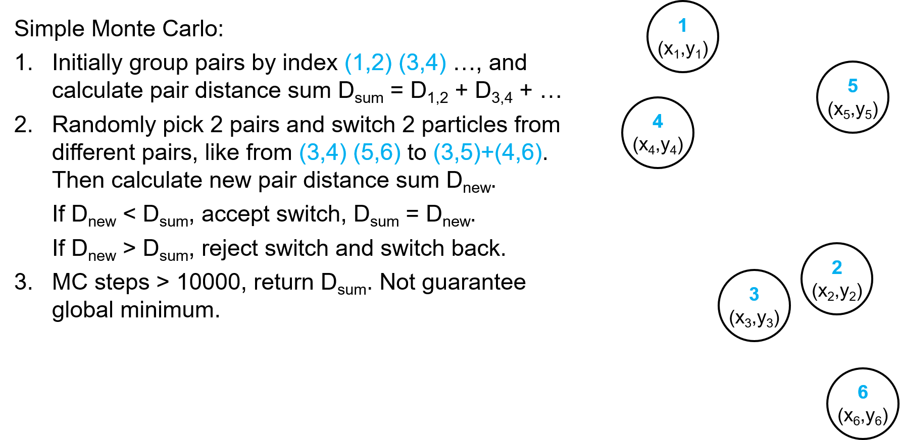
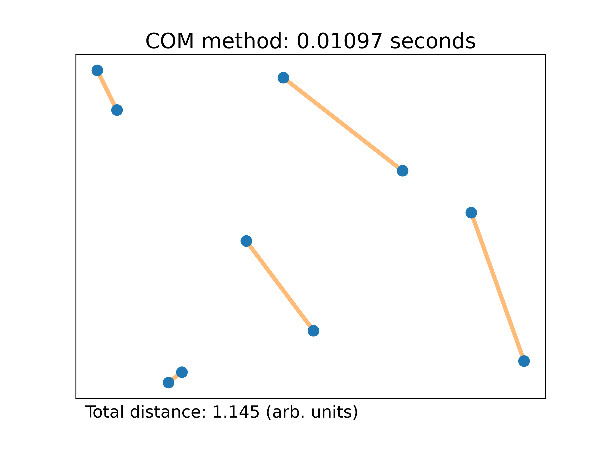
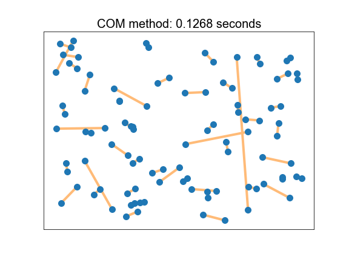
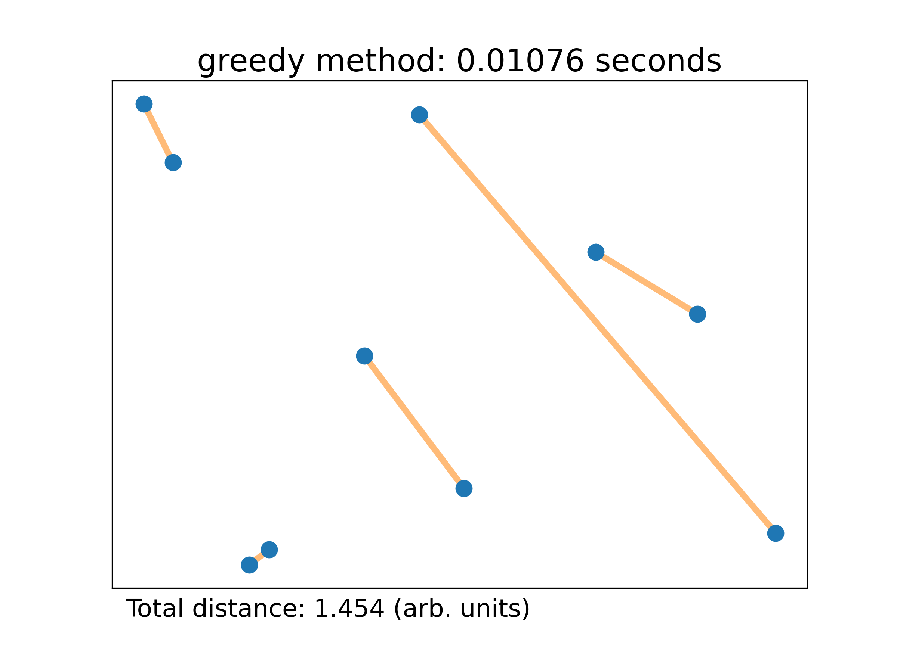
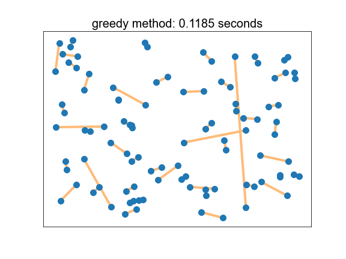

# The Best Pairs Finder Project

This module implements an algorithm that takes in an even number of N particles in D dimensions and groups them by pairs to heuristically minimize the overall summed distance between each pair of particles.

## How to install the module

Install PairFinder by first cloning the repository, entering your username and password when prompted:
`git clone https://github.com/dgunruh/PairFinder`
You can then pip install this module by navigating in the terminal to the directory with the README and entering
`pip install .`
or equivalently `pip install /path/to/this/directory/`.

## Example particle generator

If you wouldl like to use a particle generator, one is available in `test/particle_generator.py`. An example use is shown in `Tutorial 1` under `Tutorials/`.

## Tutorial

A tutorial using a Jupyter notebook can be found in the `Tutorials/` directory. This tutorial also includes visualization of the results.

## Methods

#### Brute force approach

`enumerate` - the enumerate method is the brute force approach to the problem. NOTE: This is not recommmended for 16+ particles. This method calculates every single possible combination of pairs of particles, finds the 

#### Graph-based approaches

`greedy` - This approach generates a fully connected graph where each node is a particle. It then selects the pair of particles belonging to the smallest edge and pops that from the graph. It continues to do this one by one until all particles belong to a pair.

`COM` - The "Center of Mass" approach is similar to the greedy approach and is inspired by the one-dimensional analytical solution to this probelm. Like the greedy approach, it starts with a fully connected graph, but selects the smallest edge corresponding to the particle farthest away from the center of the graph.

#### Stochastic approach

`simulated_annealing` - This uses a Monte Carlo approach to stochastically switch pairs of particles following a simulated "temperature" to control the probability. See the diagram below for a simple explanation of the steps (without the temperature dependence):

## Results

## Discussion

Both graph-based approaches (greedy and COM) are really fast. Although the COM seems to do better than the greedy approach for smaller sets (~10), they both do poorly on 100 particles. Even though the simulated annealing approach is the slowest, it gets closest to the global minimum (according to our tests on 10 particles in 3 dimesnions).
