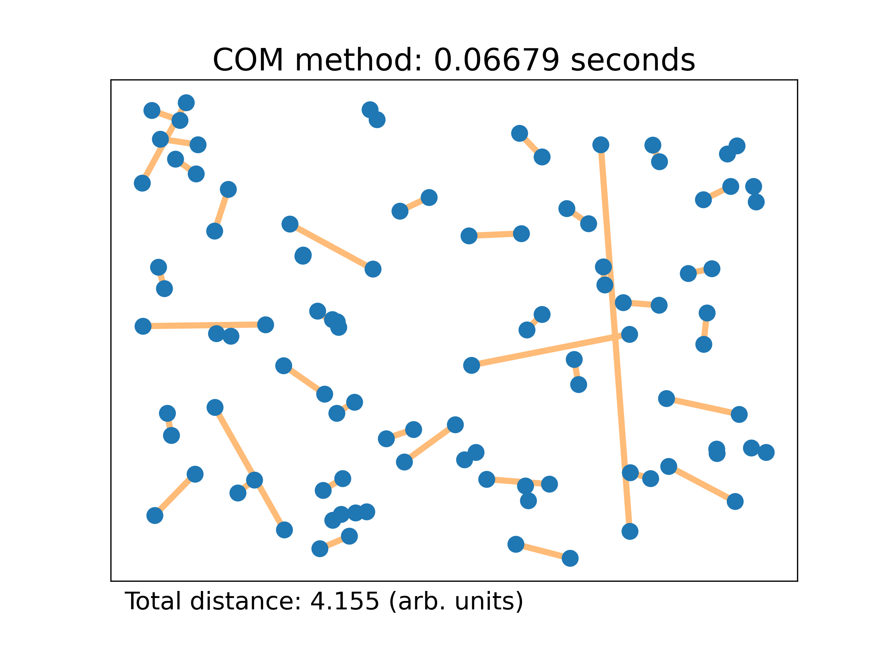
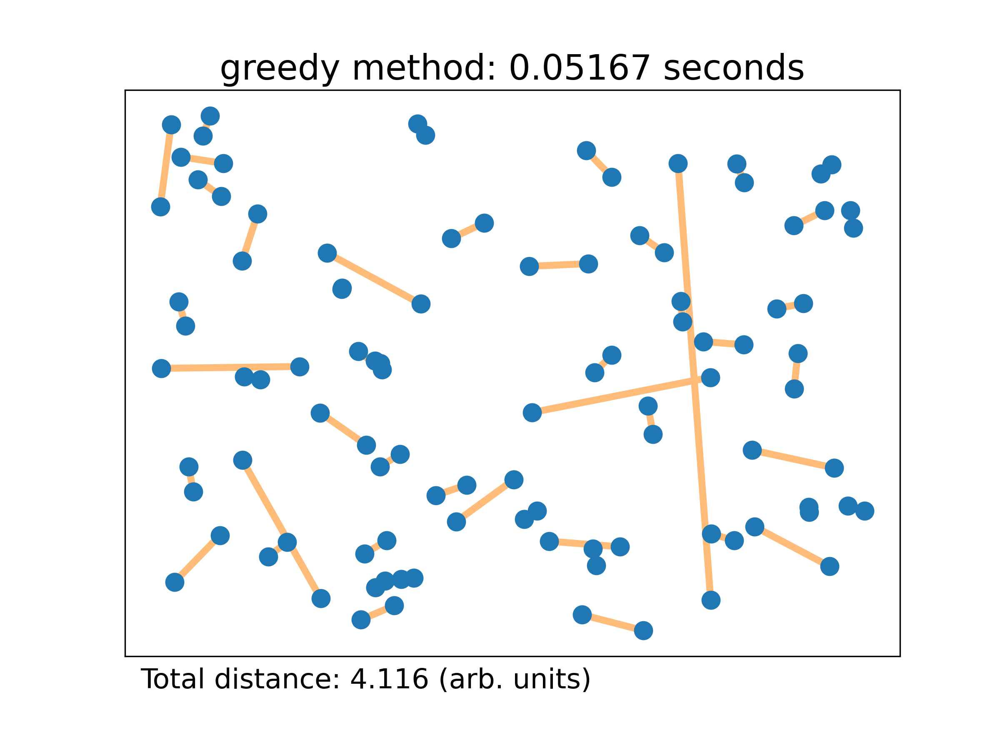

# The Best Pairs Finder Project

This module implements an algorithm that takes in an even number of N particles in D dimensions and groups them by pairs to heuristically minimize the overall summed distance between each pair of particles.

## How to install the module

You can pip install this module by navigating in the terminal to the directory with this README and entering
`pip install .`
or equivalently `pip install \path\to\this\directory\`.

## Example particle generator

If you wouldl like to use a particle generator, one is available in `test/particle_generator.py`. An example use is shown in `Tutorial 1` under `Tutorials/`.

## Tutorial

A tutorial using a Jupyter notebook can be found in the `Tutorials/` directory. This tutorial also includes visualization of the results.

## Results

